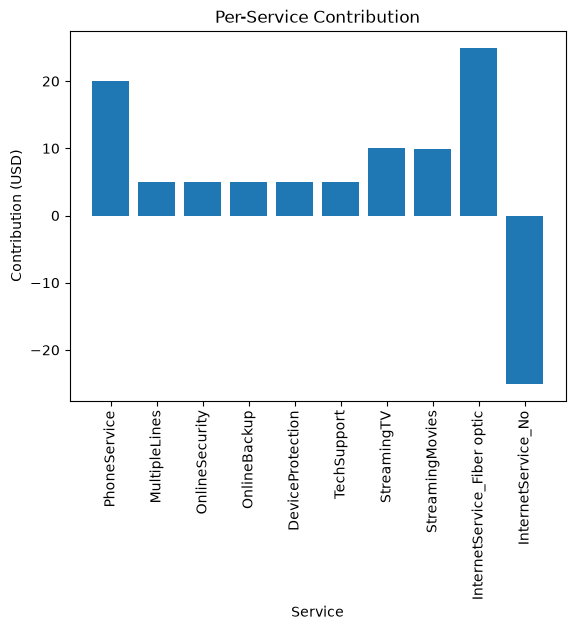

# Telco Monthly Charge Model — Findings Summary

Multivariable linear regression predicting `target` (monthly charge) from the ten
service indicators, trained on an 80/20 split (`random_state=42`) of the 7,043-row
`telco.csv`. Full code in `telco_regression.ipynb`.

## 1. Base plan cost
**$24.97/month** before any add-ons (the model's intercept).

## 2. Per-service contribution
| Service | $/month |
|---|---|
| InternetService_Fiber optic | +$24.95 |
| PhoneService | +$20.04 |
| StreamingTV | +$9.98 |
| StreamingMovies | +$9.95 |
| OnlineSecurity | +$5.05 |
| TechSupport | +$5.03 |
| MultipleLines | +$5.01 |
| DeviceProtection | +$5.01 |
| OnlineBackup | +$4.98 |
| InternetService_No | −$25.05 |

## 3. Most / least expensive add-on
**Fiber internet** (~$24.95) is the priciest positive add-on. **Online backup**
(~$4.98) is the cheapest, though it's essentially tied with the other four
~$5 services.

## 4. Fiber + both streaming services
Expected bill increase: **~$44.88/month** over the base plan (fiber + StreamingTV
+ StreamingMovies coefficients summed).

## 5. Phone + multiple lines + tech support
Expected monthly charge: **~$55.05**.

## 6. Which services vs. how many
Knowing *which* services matters far more than knowing *how many*. The
multivariable model reaches **R² ≈ 0.999** and **MAE ≈ $0.79**, while a baseline
model using only the count of add-ons reaches **R² ≈ 0.70** and **MAE ≈ $14.24**
on the identical test split. Two customers with the same add-on count can carry
very different bills (a cheap add-on vs. fiber internet), so the count alone
badly under-explains price.

## 7. Prediction accuracy on unseen customers
Well within a few dollars — test-set **MAE ≈ $0.79**, **RMSE ≈ $1.05**. The
predicted-vs-actual plot sits almost exactly on the diagonal across the full
price range ($18–$119).

## 8. Do the learned prices look like a real price list?
Yes — the coefficients round to clean, plausible price points ($5 for small
add-ons, $10 for streaming, $20 for phone, $25 for fiber), consistent with an
actual internal price sheet. The one coefficient that looks odd at first —
`InternetService_No` at about **−$25** — isn't a red flag: it's the dummy-variable
encoding correctly removing the internet base charge for customers who have no
internet service at all, rather than an unexplained discount.
