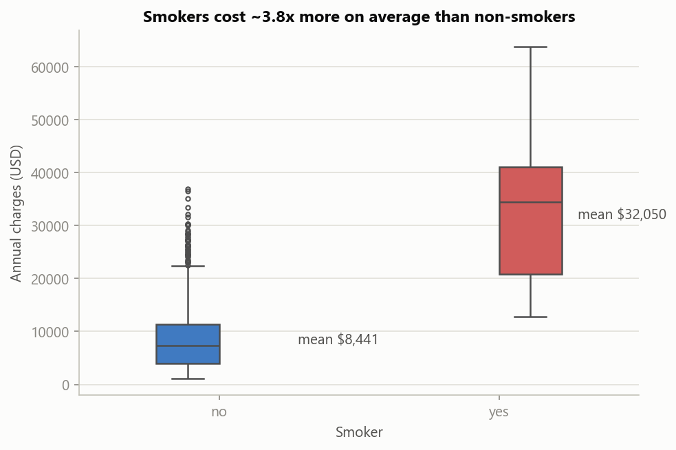
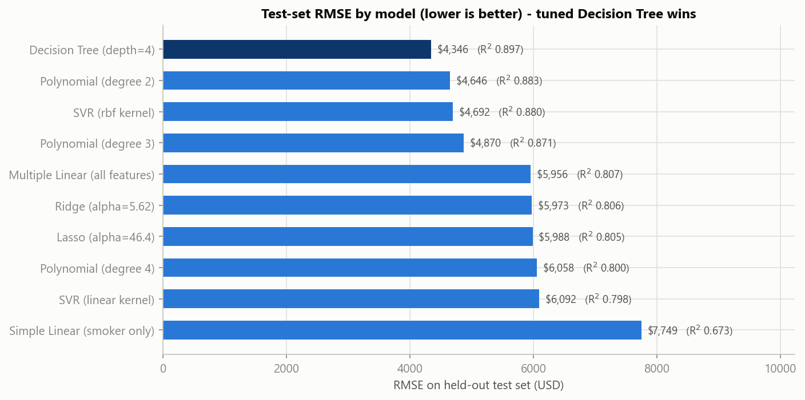

# HealthGuard Insurance — Medical Charges Analysis & Pricing Models

**EECE 6544: Introduction to Machine Learning and Pattern Recognition · Summer 2026 · MiniProject #02**

## What this project does

HealthGuard Insurance prices its plans with outdated actuarial tables — underpricing high-risk customers (losses) and overpricing low-risk ones (churn). Acting as the junior data-science team for the Head of Pricing (Ms. Sarah Nabil), this project uses 1,338 historical customer records (age, sex, BMI, children, smoking status, region, annual medical charges) to deliver three things:

1. **EDA — "Understand our customers first":** cleaned data, 7 board-ready visualizations, and a plain-language summary of what drives medical costs.
2. **Regression — "Predict the medical charges":** seven model families (Simple/Multiple Linear, Polynomial 2–4, Ridge, Lasso, SVR with two kernels, Decision Tree), tuned with 5-fold cross-validation and compared on MAE, MSE, RMSE, and R² on a held-out test set.
3. **Classification — "Flag the expensive customers":** a binary flag for customers whose annual charges exceed the median ($9,386), built with seven classifiers and compared on accuracy, precision, recall, F1, and ROC-AUC.

Everything lives in one reproducible notebook: [`HealthGuard_Insurance_Analysis.ipynb`](HealthGuard_Insurance_Analysis.ipynb). The full workflow write-up is in [`TECHNICAL_REPORT.md`](TECHNICAL_REPORT.md).

## Repository layout

```
├── HealthGuard_Insurance_Analysis.ipynb   # the complete analysis (cleaning → EDA → models → recommendation)
├── TECHNICAL_REPORT.md                    # full technical report and stakeholder recommendation
├── README.md                              # this file
├── requirements.txt                       # pinned Python dependencies
├── data/
│   ├── insurance.csv                      # raw dataset (download instructions below)
│   └── insurance_clean.csv                # cleaned dataset (regenerated by the notebook)
└── charts/                                # all figures, saved by the notebook at 150 dpi
```

## How to download the dataset from Kaggle

The data is the public **Medical Cost Personal Datasets** on Kaggle: <https://www.kaggle.com/datasets/mirichoi0218/insurance>

**Option A — browser (simplest):**
1. Open the link above (a free Kaggle account is required) and click **Download**.
2. Unzip and place `insurance.csv` in the `data/` folder of this repository.

**Option B — Kaggle CLI:**
```bash
pip install kaggle                      # then place your API token in ~/.kaggle/kaggle.json
kaggle datasets download -d mirichoi0218/insurance -p data --unzip
```

A copy of `insurance.csv` (≈55 KB, public domain) is also included in `data/` so the notebook runs out of the box.

## How to run the notebook

Requires **Python 3.11+** (developed on 3.14; pandas 3.x needs ≥ 3.11).

```bash
# 1. Clone
git clone <this-repository-url>
cd <repository-folder>

# 2. Install dependencies (a virtual environment is recommended)
python -m venv .venv
.venv\Scripts\activate          # Windows   (macOS/Linux: source .venv/bin/activate)
pip install -r requirements.txt

# 3. Run end to end (either open it...)
jupyter notebook HealthGuard_Insurance_Analysis.ipynb
# ...or execute headless:
jupyter nbconvert --to notebook --execute --inplace HealthGuard_Insurance_Analysis.ipynb
```

The notebook is deterministic (`random_state = 42` everywhere): running it regenerates `data/insurance_clean.csv`, every chart in `charts/`, and identical model scores.

## Summary of findings

- **Smoking dominates everything.** Smokers (20% of customers) average **$32,050**/year vs **$8,441** for non-smokers — a 3.8× gap and a 0.79 correlation with charges. Age adds a steady ~$250–280 per year; everything else is second-order.
- **Risk multiplies — the surprising pattern.** BMI barely matters for non-smokers, but **obese smokers average $41,693** (~4.7× obese non-smokers). Any additive pricing table misprices this segment.
- **Best charge predictor: a depth-4 Decision Tree** — R² = 0.897, RMSE ≈ $4,346, typical error ≈ $2,600 — and it reads as a human-interpretable pricing rulebook (first split: *do you smoke?*). Polynomial (degree 2) is the close runner-up (R² = 0.883); degrees 3–4 demonstrably overfit.
- **Best expensive-customer flag: Random Forest** — 93.7% accuracy, F1 = 0.935, catching 91% of expensive customers on the held-out test set.
- **Recommendation to the stakeholder:** deploy the Decision Tree for premium estimation and the Random Forest for expensive-customer triage; retrain on HealthGuard's own book as it grows. Details and limitations in [`TECHNICAL_REPORT.md`](TECHNICAL_REPORT.md).

| Regression (test set) | MAE | RMSE | R² |
|---|---|---|---|
| **Decision Tree (depth 4)** | **$2,621** | **$4,346** | **0.897** |
| Polynomial (degree 2) | $2,867 | $4,646 | 0.883 |
| SVR (RBF kernel) | $2,541 | $4,692 | 0.880 |
| Multiple Linear | $4,177 | $5,956 | 0.807 |




