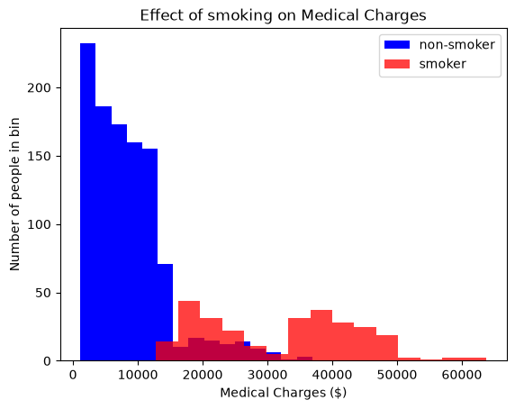
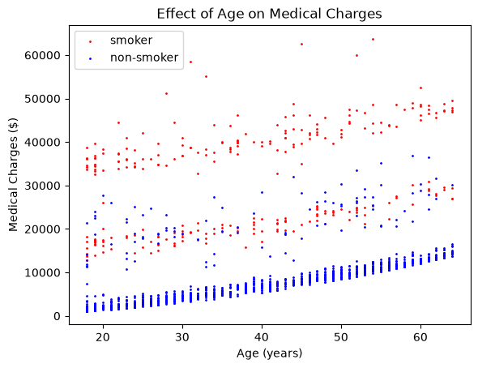
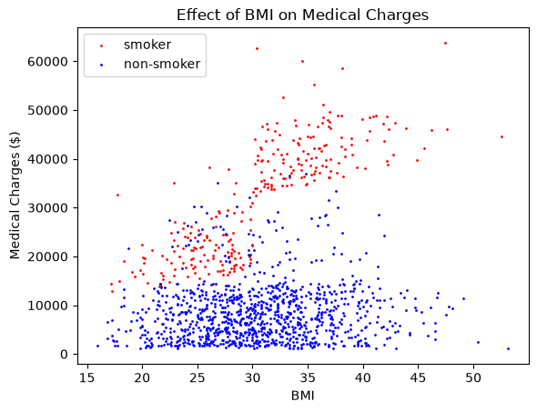
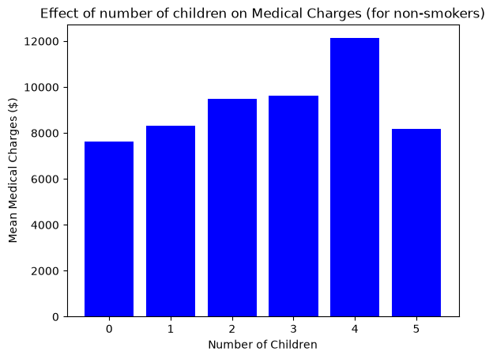
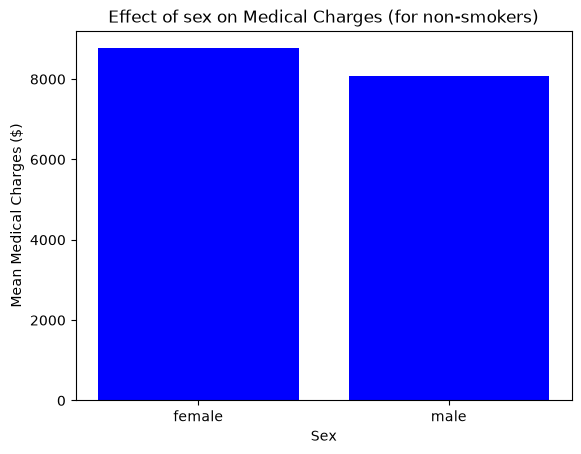
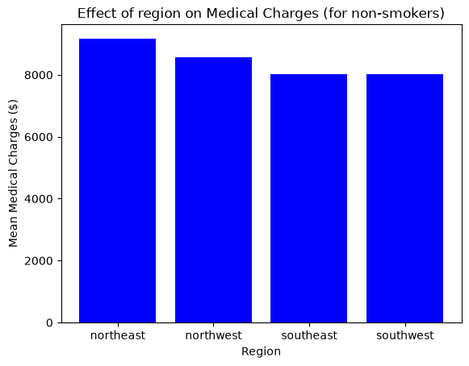
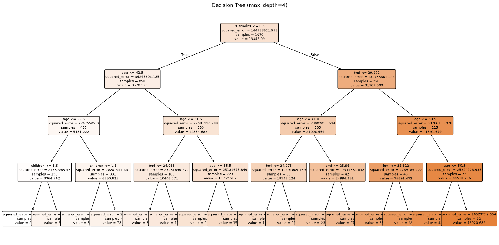
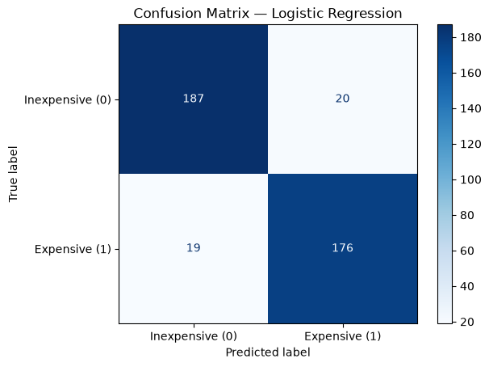

# Findings for HealthGuard Insurance Medical Costs

This program provides analysis and predictive models that are used for the medical costs.

## Data Cleaning Decisions and Rationale

This dataset had no empty fields and as such no rows were removed. There were some fields that were strings (sex, smoker, region) that were one-hot encoded. As such, the final fields used for training were as follows:
|field|datatype|
|---|---|
|age|int|
|bmi|float|
|children|int| 
|is_smoker|binary|
|is_female|binary|
|region_sw|binary| 
|region_se|binary|
|region_nw|binary|

The target was the medical cost for the customer, a double in USD.

## Exploratory Analysis

Exploratory analysis was performed on the factors provided to see which were the most significant.

#### Smoking
By far, the most significant factor impacting health costs for a customer was whether they smoked.

*Figure 1: Histogram comparing smokers to non-smokers*

As can be seen in Figure 1, being a smoker dramatically increases the price of medical charges. This divides the population into two distinct groups. Non-smokers have a denser cluster of lower-cost medical expenses, while smokers have a more spread out cluster of higher cost medical expenses. Due to this, all future analyis took smoking into account.

#### Age
Age is another factor that has a significant impact on health costs. 

*Figure 2: Scatterplot comparing customers of different ages*

As can be seen by Figure 2, as age increases medical expenses tend to increase. This makes sense, as elderly people are more likely to have age complications. However, the population appears to be broken into three distinct groups- low, medium, and high cost. Everyone in the low cost group is a non-smoker, everyone in the high cost group smokes, and the medium cost group is mixed. All three groups exhibit the same trend with age.

#### BMI
BMI is the third-most significant factor on health costs.

*Figure 3: Scatterplot comparing customers of different BMIs*

As can be seen by Figure 3, as bmi increases, medical expenses tend to increase. However, this trend is most pronounced with smokers. With non-smokers, there is very little to no correlation, but with smokers the correlation is stark. 

#### Number of Children
To prevent any extraneous correlations stemming between smoking habits and number of children, only non-smokers were analysed in this.

*Figure 4: Bar Plot comparing number of children and expenses*

As can be seen by Figure 4, there is a slight correlation of between number of children and medical expenses. This correlation reverses with 5 children, which is just likely due to a small sample size (having 5 children is unusal in the dataset).

#### Sex and Region
Only non-smokers were also analysed for sex and region

*Figure 4: Bar Plot comparing sex and expenses *

*Figure 4: Bar Plot comparing region and expenses*

As can be seen by Figures 5 and 6, sex and region only have a slight effect on medical costs.

## Predicting Medical Charges (Regression)

#### Simple Linear Regression
A simple linear regression model was used to predict medical expenses based on the best predictor: whether a customer was a smoker. In this test, the $R^2$ was 0.6602, which is not great but not awful for such a simple model.

Based on this model, the expenses for non-smokers (bias) is \$8578.32 and for smokers it is \$31767.01.

#### Multivariable Linear Regression
A multivariable linear regression model was used to predict medical expenses with all predictors. In this test, the $R^2$ was 0.7836. The effect of each variable is as shown:

|Variable|Effect|
|---|---|
|Age|$256.98 / year|
|BMI|$337.09 / BMI|
|Children|$425.28 / child|
|Smoking|$23,651.13 extra for smoking|
|Sex|$18.59 extra for females|

*Table 1: Effect of Different Variables on Cost*

|Region|Cost Increase|
|---|---|
|Southwest|$0|
|Southeast|$151.14|
|Northwest|$439.02|
|Northeast|$809.80|

*Table 2: Cost Increase for Each Region*

#### Polynomial Regression

Polynomial Regression was performed with degrees 2, 3, and 4. The results are shown in Table 3.

|Degree|Training $R^2$|Testing $R^2$|
|---|---|---|
|2|0.8418|0.8666|
|3|0.8474|0.8654|
|4|0.8513|0.8581|

*Table 3: Performance of Each Degree in Polynomial Regression*

As can be seen, the best performance happens at degree two. This is a classic example of overfitting, as a higher degree leads to a better $R^2$ in training but a worse one in testing, meaning the model is learning the noise of the data.

#### Ridge Regression

|Alpha|Testing $R^2$|
|---|---|
|0.01|0.7834|
|0.05|0.7834|
|0.1|0.7834|
|0.5|0.7834|
|0.8|0.7834|
|1|0.7834|
|10|0.7829|
|100|0.774|
|1000|0.5881|

*Table 4: Effect of Alpha on Ridge Regression*

As can be seen by Table 4, the best alpha for Ridge Regression was around 1. Ridge performed just as well as linear regression because this dataset does not have enough features for feature minimization to improve results.

#### Lasso Regression

|Alpha|Testing $R^2$|Features Removed|
|---|---|---|
|0.01|0.7834|None|
|0.05|0.7834|None|
|0.1|0.7834|None|
|0.5|0.7834|None|
|0.8|0.7834|None|
|1|0.7834|None|
|10|0.7829|Sex|
|100|0.774|Sex|
|1000|0.5881|Sex, Region, Children|

*Table 4: Effect of Alpha on Lasso Regression*

As can be seen by Table 5, the best alpha for Lasso Regression was around 1. Lasso performed just as well as linear regression because this dataset does not have enough features for feature minimization to improve results. However, the removal of sex, region, and children at higher alphas verifies that these are the least significant features.

#### Support Vector Regression
For SVR, linear, rbf, and polynomial kernels were used. 

|Kernel|$R^2$|MAE|MSE|RMSE|
|---|---|---|---|---|
|linear|0.7373|$3322.12|$40791352.5|$6386.81|
|rbf|0.865|$2608.92|$20958145.6|$4578.01|
|polynomial|0.852|$2533.06|$22971747.32|$4792.89|

*Table 5- Performance of Various Kernels*

In most attributes, the rbf (or Gaussian) kernel performs best, although the polynomial kernel performs almost as well. This makes sense, as most actual attributes tend to follow normal distributions. 

#### Decision Tree Regression
|Depth|Training $R^2$|Testing $R^2$|
|---|---|---|
|2|0.8235|0.8321|
|3|0.8537|0.8531|
|4|0.8653|0.8641 |
|5|0.8798|0.8336|
|6|0.891|0.8237|

*Table 6- Performance of Different Tree Depths*

As can be seen, the tree depth of 4 is the best and past this overfitting occurs. The tree disgram of this depth is shown in Figure 7.

*Figure 7: Decision Tree Diagram*

#### Algorithm Comparison
|Algorithm|$R^2$|MAE|MSE|RMSE|
|---|---|---|---|---|
|Linear Regression|0.6602|$5625.81|$52745964.73|$7262.64|
|Multivariable Linear Regression|0.7836|$4181.19|$33596915.85|$5796.28|
|Polynomial Regression|0.8666|$2729.5|$20712805.99|$4551.13|
|Ridge Regression|0.7834|$4187.71|$33633901.07|$5799.47|
|Lasso Regression|0.7834|$4186.27|$33631303.77|$5799.25|
|SVR|0.865|$2608.92|$20958145.6|$4578.01|
|Decision Tree|0.8641|$2697.77|$21093484.0|$4592.76|

*Table 7- Comparison of Different Algorithms*

Based on this data, a Decision Tree is likely the best option. The Decision Tree, SVR, and Polynomial Regression all show similar results, but the decision tree is more similar to how actual decisions are made in the insurance world. Additionally, the decision tree is easier to understand and can be used by a human.

## Flagging Expensive Customers

A classification model was made to identify customers as being above or below the median. A Logistic Regression model was used with an accuracy of 90%. The Confusion Matrix is shown below:

*Figure 8- Confusion Matrix for Expensive Customer Flagging*

As can be seen by the confusion matrix, the model is good at flagging expensive customers and has a low false positive and false negative rate.

